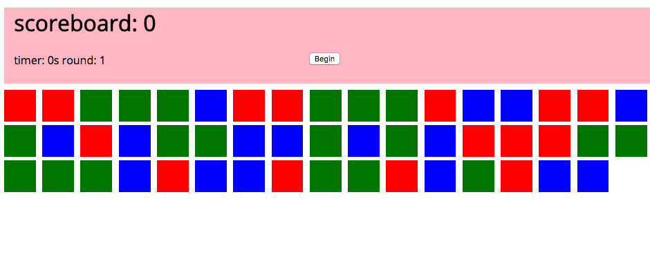

### Poke A Square

- Were goin to make a game that looks like the following.



- The objective of our game is to click on as many blue squares as possible during the alloted time

### User Stories/game logic

-  When the user clicks begin the timer should start, and the squares should populate with a random color

-  When the use clicks on a color the color should disapear, and score should be added or subtracted

- When the round is over the scores round and time should be updated and the user should be able to start again with increased difficulty. 


### setup 

- open up the `pokeAsquare` folder in student examples, and read over the code


### Let's begin 

- the first step we are going to tackle is the activating the begin button and load the squares

```javascript
  $('button').on('click', () => {

   console.log('this is working')

  })
```

- Lets Review Branches, for each problem today we want you to create a branch for each function you try to create, so for example

1. git checkout -b createSquares
2. write your code
3. git add & commit your code, then you are free to change back to the master branch, were you will be able to pull down the instructors code at anytime.


- Now we need to write a method named (createSquares) that sets up our squares, Try to write a function that takes a parameter `numberOfSquares` that will create an arbitary number of divs depending on the parameter and attach them to the squares class from the html. 

```javascript
  const game = {
    createSquares(numberOfSquares){
      for (let i = 0; i < NumberOfSquares; i++){
          const square = $('<div/>')
          $('.squares').append(square)
      }
    }
  }

```

- lets call createSquares in the start button function

```javascript
  $('button').on('click', () => {

    game.createSquares();

  })

```
- Now we have a bunch of blue squares, but we want our squares to have a random, red, blue, or green color try to write a method to make that happen.


```javascript

// inside of game object
applyRandomColor(square) {
  const randNum = Math.floor(Math.random() * 3) + 1

    if(randNum === 1) {
      square.css('background-color', 'red')

    } else if(randNum === 2){
      square.css('background-color', 'blue')

    }
    else {
      square.css('background-color', 'green')

    }
}
```

-  Where do we use that function?

```javascript
//inside of game object
 createSquares(numberOfSquares) => {
  for (let i = 0; i < numberOfSquares; i++){
      const square = $('<div/>');

        this.applyRandomColor(square);

      $('.squares').append(square);
  }
}
```

-  Now that we have colored squares, lets make them clickable, and hidden when we click on them.  Give it a try!


```javascript
//inside of game object
createSquares(numberOfSquares){
  for (let i = 0; i < numberOfSquares; i++){
      const square = $('<div/>')

      this.applyRandomColor(square);

      $('.squares').append(square);
   }
  $('.squares').on('click', this.handlePoke.bind(this);
}


// inside of game object
handlePoke(e){
    console.log(e.target)
    $(e.target).css('opacity', 0);
  };
```
- we can make this simple by using jQuery's css method to make the opacity go to zero. 

-  Okay now how do we know if we are clicking on a blue square or not?
-  we can use the css method again like this!

```javascript
handlePoke(e) {
    console.log(e.target)
    $(e.target).css('opacity', 0);
    const color = $(e.currentTarget).css('background-color');
  };
```

- `console.log(color)` it should return something like this `'rgb(0, 0, 255)'`

- So how can we use that, lets write a function that takes that string and if it is blue lets update a global `score` variable.

- create your score property on your game object: 

```javascript
  const game = {
    score: 0,
    //rest of methods
  };
```

-  One way to do it is like the following

```javascript
// inside game object
checkValidPoke(square){
  console.log(square, typeof square)
  

  if(square === 'rgb(0, 0, 255)'){
    this.score++;
    console.log(this.score)
  } else {
    this.score--;
    console.log(this.score)
  }

}
```

  - substring lets us take out part of a string.
  - then we are splitting the string by the places so we can get an array number of strings then we are parsing the second index item in the newly created array because we only care about the blue value in rgb

  - now where do we use this? 

```javascript
// inside game object
hanldePoke(e){
      console.log(e.target)
      $(e.target).css('opacity', 0);
      const color = $(e.currentTarget).css('background-color');
      this.checkValidPoke(color)
   };
```

- Now lets update the dom with the value of score, give it a try! (Hint: you can do it in the function you just made)

```javascript
// inside game object
checkValidPoke(square){
  console.log(square, typeof square)
  const colors = square.substring(4, square.length-1).split(" ");
  const blue = parseInt(colors[2])

  if(blue === 255){
    console.log('this is passign')
    this.score++;
    $('h1').text('scoreboard: ' + this.score)
  } else {
    this.score--;
    $('h1').text('scoreboard: ' + this.score)
  }

}
```

- We got alot of the gameplay working now lets set up our timer

- Set up some properties by the score property like the following 

```javascript

const game = {
  score: 0,
  time: 30,
  round: 1
  // rest of game property
}
```

- now try to write a function called `setTimer` thats starts an interval and countsdown to 0 and when it reaches 0 increase the round

```javascript
setTimer(){
  const timer = setInterval(()=>{
    this.time--
    if(this.time === 0){
      clearInterval(timer)
      this.round++;
    }

    $('#timer').text(`Time ${this.time}s`)

  }, 1000)
}
```

- clearInterval stops the interval saved in the variable `timer`.  The second arguement is the time in ms that the function in the first argument will run. 


- Now write a function called setupRound, that will change the round number on the DOM and set up a new game, if we do this we can just call it in the button so we can reuse that button every round!


```javascript
setUpRound() {
    $('.squares').empty();
    $('#round').text('round: ' + this.round)

    if(this.round === 1){
      this.createSquares(50);
      this.time = 30;
    } else if(this.round === 2){
      this.createSquares(100);
      this.time = 20;
    } else if(this.round === 3){
      this.createSquares(150);
      this.time = 10;
    } else {
      this.createSquares(250);
      this.time = 10;
    }

 }

```

- We can add some logic here to make the game easier

- Now lets just call our `setUpRound` function in the button

```javascript
  $('button').on('click', () => {

    game.setTimer();
    game.setupRound();

  })

```


-  This has meant our requirements or in other words our MVP (minimum viable product)

___

### Extras

- So whats some add on we can make up and do together?
- Make the squares lose transparency during each round so you have to click faster.
- Make a Modal to gather the players name at the beginning of the game, and leave them a greeting in the header
- Can you refactor your code to encapsulate your methods and variables in an object
- Style it make it look nice
- Make a sound when you click a wrong one or a right one.
- have a modal pop up at the begining of a ready so the user knows how to continue
- make a section about how to play the game (how do you want to do that? an About page, in the header, a modal, idk???? anything you can imagine)
- Anything you can imagine, any twist, any turn you like, USE USE USE your imagination in this, it will allow you to create worlds.
